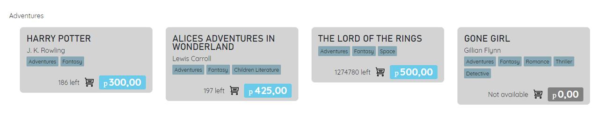

# ✨ Функционал

## Просмотр списка книг

Самая простая функция - отображение записей базы данных с книгами на главной странице сайта.

## Просмотр списка книг по выбранному жанру/автору

Можно увидеть список книг по выбранному жанру (автору), если нажать на соответствующий жанр (автора) в карточке книги, или если выбрать жанр (автора) на странице Жанров (Авторов).

<figure><figcaption>
Книги содержащте жанр Adventures (Приключения)
</figcaption></figure>

## Просмотр подробной информации о книге

Если нажать на карточку книги, открывается отдельная страница с подробной информацией об этой книге, содержащая также обложку книги и описание.

## Авторизация и аутентификация

В проекте реализована простая авторизация и аутентификация с помощью JWT-токенов и встроенных возможностей Blazor и ASP.NET.

<figure><figcaption>
Простой интерфейс авторизации на сайте
</figcaption></figure>

## Добавление книги в корзину

Предыдущие функции были доступны неавторизованным пользователям. Следующие действия может выполнять только авторизованный пользователь.

Книги можно добавлять в корзину, только если они есть на складе.

<figure><figcaption>
Книга Harry Potter добавлена в корзину пользователя
</figcaption></figure>

## Осуществление покупки

Можно "купить" книги, которые пользователь добавил в свою корзину. Тогда количество соответствующих книг на складе уменьшается.

&#x20;

<figure><figcaption></figcaption></figure>

## Создание, удаление, изменение книги/жанра/автора в Панели Администратора

Если пользователь имеет права Администратора, ему доступна Панель Администратора, где можно создавать, удалять и менять книги/жанры/авторов, представленных на сайте.
