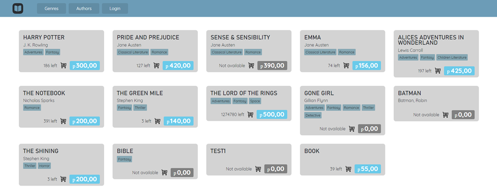

# 👀 Просмотр списка книг

Чтобы посмотреть список книг, вам ничего не нужно кроме нескольких записей в таблице Books и запущенного проекта.

Список книг можно увидеть на главной странице запущенного проекта. Главная страница выглядит по-разному для авторизованных и неавторизованных пользователей, но список книг легко заметить.

<figure><figcaption>
Главная страница, когда пользователь не авторизован
</figcaption></figure>

<figure><figcaption>
Главная страница, когда пользователь авторизован
</figcaption></figure>

Если вы хотите увидеть список книг по выбранному жанру, вы можете:

*   открыть список жанров\

    <figure><figcaption></figcaption></figure>

    <figure><figcaption></figcaption></figure>

    и нажать на выбранный жанр;
* нажать на жанр внутри карточки книги

Результат выполнения одного из этих действий:

<figure><figcaption>
Книги с жанром Adventures
</figcaption></figure>

Аналогично можно получить список книг по выбранному автору.
